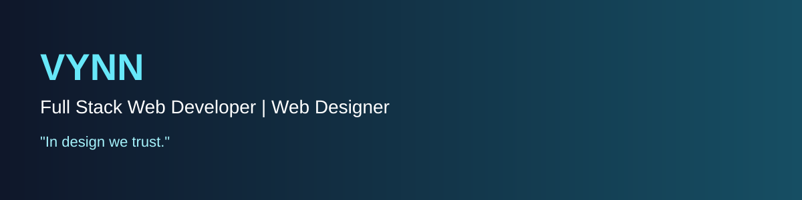

# 
Hi, I'm Vynn 👋

**Full Stack Web Developer | Web Designer**

> *"In design we trust."*

## 🚀 About Me

I'm **Vynn**, a passionate Full Stack Web Developer and Web Designer who enjoys building modern, responsive, and user-friendly web applications. I continuously explore new technologies and improve my design skills to create clean and meaningful digital experiences.

- 🌱 Currently learning **Professional Web Design**
- 🎯 Passionate about UI, UX and modern web technologies
- 🎮 Interested in 2D Game Development
- 💡 Always learning and building

## 💻 Tech Stack

### Languages

### Frameworks & Libraries

### Databases
MySQL • PostgreSQL • Firebase • DBeaver

### Tools
VS Code • Git • GitHub • Figma • Laragon • XAMPP

## 📊 GitHub Analytics

> Replace `Vynn-Dev` if your username changes.

## 🏆 Achievement

- 🥇 #JuaraVibeCoding Certificate

## 👥 Community

- Pixel Civic

## 📫 Connect With Me

- 📧 **Email:** vinnpratama2611@gmail.com
- 💼 **LinkedIn:** Vino Pratama
- 📷 **Instagram:** @vynn_prtm

---

Thanks for visiting my profile 💙

**In design we trust.**

